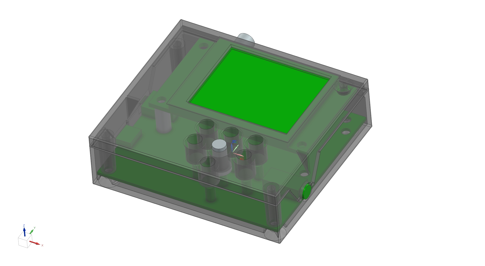

# FMDABRadio

> This package uses the consolidated `src/si4684.cpp/.h` radio core. The old
> `DABShield` / `Si4684Radio` parallel implementations are removed. See
> `MIGRATION_REPORT.md` for the hardware-specific differences from
> `bales0/SI4684-FMDAB-Receiver`.

# FMDABRadio

FM and DAB+ Radio receiver based on Si4684 chip

Based on:

FW and HW: <https://www.elektormagazine.com/labs/radio-dab>

DAB+ module: <https://dirb.me/doku.php?id=de:tech:dabmodule>

Radio protocol library:

[`Si468x_library`](https://github.com/bales0/Si468x_library) is vendored in
`src/vendor/si468x` at the pinned revision recorded in `VENDOR.md`. The board
adapter uses a cooperative, GPIO26-INTB-driven command engine; SPI is never
performed in the ISR.

<https://github.com/sparkfun/SparkFun\_External\_EEPROM\_Arduino\_Library>

FW and HW has been little bit redesigned to use INTERNAL PULL\_UPs and possibility to drive LCD background light.

Regional character table of RDS and DAB replaced to show correctly on LCD. Thanks to Sjef https://github.com/PE5PVB/SI4684-DAB-Receiver/tree/main for character conversion table.

The Si4684 DAB/FM images remain in the receiver board's external NVSPI flash.
The ESP32 loads them from `0x086000` (DAB) and `0x106000` (FM).

Migration details, scheduler intervals and the physical hardware verification
checklist are in [MIGRATION_REPORT.md](MIGRATION_REPORT.md). Desktop regression
tests are described in [tests/README.md](tests/README.md).

## Controls

The seven-button front panel keeps its original electrical layout. Controls are
context-sensitive so features from the rotary-control reference receiver remain
available:

- `VOL+` / `VOL-`: volume; in Settings they change the selected value.
- `CH+` / `CH-`: preview the next/previous stored station, with wrap at both
  ends; the grey station name marks an unconfirmed preview. In lists and
  Settings these buttons move the selection.
- short `SCAN`: open the station list. During a scan it cancels safely.
- hold `SCAN`: full DAB or regional FM scan.
- `BAND`: switch FM/DAB; during a scan it cancels and queues the switch.
- short `SELECT`: tune a previewed/list station, otherwise switch between Text
  and SlideShow in DAB.
- hold `SELECT`: open/close Settings.

Settings include backlight/dimming, SlideShow mode/layout, FM region, automatic
AF, signal units (`dBm`, `dBf`, `dBuV`), three compact themes, English/Czech
labels and serial-control enable. The main status shows DAB lock/MOT loading and
the FM AF state by colour.

## Added FM/DAB functions

- RDS/RBDS PI, PS, RadioText, PTY names, TP/TA, AF list and validated group-4A
  clock with broadcast UTC offset.
- Optional automatic AF probing with PI verification, RSSI/SNR hysteresis,
  bounded timeouts and restoration of the original frequency on failure.
- Regional FM tuning and seek through serial control.
- FM scan metadata (PI/RSSI/SNR) stored in a separate, region-tagged EEPROM
  extension without changing legacy 13-byte station records.
- DAB audio/data service settling and service-context filtering for MOT/SLS.
- Optional non-blocking serial control; see [SERIAL_PROTOCOL.md](SERIAL_PROTOCOL.md).
